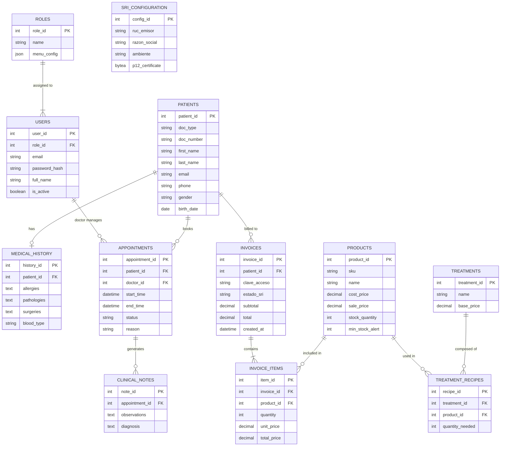

# 🗄️ Esquema de Base de Datos - Sistema Médico

Este documento detalla la estructura de la base de datos PostgreSQL, incluyendo diagramas de relaciones y descripciones de tablas.

---

## 📊 Diagrama Entidad-Relación (ERD)

---

## 📚 Diccionario de Datos Detallado

### 1. Módulo de Autenticación (`auth_service`)

| Tabla | Descripción | Columnas Clave |
|-------|-------------|----------------|
| **`roles`** | Define los perfiles de acceso (Admin, Médico, Recepción). | `menu_config`: JSON con permisos de UI. |
| **`users`** | Usuarios del sistema. El `role_id` define sus permisos. | `full_name`: Nombre visible en sidebar. |

### 2. Módulo de Historia Clínica (`historia_clinica_service`)

| Tabla | Descripción | Columnas Clave |
|-------|-------------|----------------|
| **`patients`** | Información demográfica. | `doc_number`: Identificador único (Cédula/RUC). |
| **`medical_history`** | Antecedentes médicos (1 a 1 con Paciente). | `allergies`, `blood_type`. |
| **`clinical_notes`** | Notas de evolución asociadas a una cita. | `diagnosis`: Diagnóstico médico. |

### 3. Módulo de Citas (`citas_service`)

| Tabla | Descripción | Columnas Clave |
|-------|-------------|----------------|
| **`appointments`** | Agenda médica. Relaciona Paciente y Doctor. | `status`: (PENDING, CONFIRMED, COMPLETED, CANCELLED). |

### 4. Módulo de Inventario (`inventario_service`)

| Tabla | Descripción | Columnas Clave |
|-------|-------------|----------------|
| **`products`** | Ítems físicos (medicamentos, insumos). | `min_stock_alert`: Umbral para alertas. `sku`: Código único. |
| **`treatments`** | Servicios médicos ofrecidos. | `base_price`: Precio base del servicio. |
| **`treatment_recipes`** | Receta de insumos para un tratamiento. | Permite descontar stock automáticamente al realizar un tratamiento. |

### 5. Módulo de Facturación (`facturacion_service`)

| Tabla | Descripción | Columnas Clave |
|-------|-------------|----------------|
| **`invoices`** | Cabecera de facturas electrónicas. | `clave_acceso`: 49 dígitos SRI. `estado_sri`: Estado de autorización. |
| **`invoice_items`** | Detalle de productos/servicios facturados. | Relacionado con `products`. |
| **`sri_configuration`** | Configuración del emisor y certificados. | Almacena el `.p12` y credenciales. |

---

## 🔗 Relaciones Críticas de Microservicios

Aunque los servicios son independientes, comparten la base de datos PostgreSQL (en el esquema actual monolítico de BD) lo que permite integridad referencial fuerte:

1.  **Facturación -> Inventario**: `invoice_items` referencia a `products` para obtener precios y nombres.
2.  **Citas -> Usuarios**: `appointments` referencia a `users` (Doctores).
3.  **Citas -> Historia**: `clinical_notes` se crea a partir de una `appointment` completada.

## 📝 Notas de Implementación

-   **Integridad**: Todas las claves foráneas (`FK`) tienen restricciones `ON DELETE RESTRICT` o `CASCADE` según corresponda.
-   **Auditoría**: Casi todas las tablas incluyen `created_at` (timestamp con zona horaria).
-   **JSONB**: Usado en `roles.menu_config` para flexibilidad en la configuración de la UI.
